# 🏗️ Architecture

WATA uses a microservice architecture with:

| Component (roles) | Purpose                                                       |
|-------------------|---------------------------------------------------------------|
| **Web Server**    | Receives webhook signals from third party (like: TradingView) |
| **Trader**        | Executes Saxo Bank API operations                             |
| **Scheduler**     | Manages job orchestrations                                    |
| **Telegram**      | Delivers notifications and alerts                             |
| **RabbitMQ**      | Handles inter-component messaging                             |

```mermaid
flowchart TD
    %% Styling
    classDef external fill:#f9f9f9,stroke:#aaa,stroke-width:1px,color:#000
    classDef processing fill:#e1f5fe,stroke:#03a9f4,stroke-width:1px,color:#000
    classDef execution fill:#e8f5e9,stroke:#4caf50,stroke-width:1px,color:#000
    classDef jobs fill:#fff8e1,stroke:#ffc107,stroke-width:1px,color:#000
    classDef database fill:#f3e5f5,stroke:#9c27b0,stroke-width:2px,stroke-dasharray: 5 5,color:#000
    classDef reporting fill:#ffebee,stroke:#f44336,stroke-width:1px,color:#000
    
    %% External Systems
    subgraph ExtSys["🌐 External Systems"]
        direction LR
        TV("🖥️ TradingView/<br>Signal Source")
        SB("🏦 Saxo Bank API")
        User("👤 User/Trader")
        TG("📱 Telegram Service")
    end
    
    %% WATA Core Services
    subgraph CoreSys["⚙️ WATA Core Services"]
        direction TB
        
        subgraph SigProc["📡 Signal Processing"]
            direction LR
            WS("🔌 Web Server")
            RMQ("📨 RabbitMQ<br>Message Broker")
        end
        
        subgraph ExecEng["💹 Execution Engine"]
            direction LR
            TR("💱 Trader Service")
            DB[("💾 DuckDB")]:::database
        end
        
        subgraph JobSvc["⏱️ Jobs Orchestration"]
            direction LR
            SC("🔄 Scheduler")
        end
    end
    
    %% Reporting System
    subgraph RepSys["📊 Local Reporting System"]
        direction LR
        EX("🔄 Data Export")
        OD("📈 Observable<br>Dashboard")
    end
    
    %% Connections with styled arrows
    TV -- "1️⃣ Webhook Signal" --> WS
    WS -- "2️⃣ Signal Message" --> RMQ
    RMQ -- "3️⃣ Position Request" --> TR
    TR -- "Authentication" --> SB
    User -- "Auth Code" --> TR
    TR -- "4️⃣ Trading Operations" --> SB
    TR -- "Send Notification" --> RMQ
    RMQ -- "Notification Request" --> TG
    TG -- "5️⃣ Notifications" --> User
    TR <-- "Position Data" --> DB
    SC -- "Periodic Tasks" --> RMQ
    RMQ -- "Status Tasks" --> TR
    TR <-- "Performance Data" --> DB
    DB -. "6️⃣ Manual Data Sync" .-> EX
    EX -. "Data Transform" .-> OD
    OD -. "7️⃣ Performance<br>Visualization" .-> User
    
    %% Apply styles
    class TV,SB,User,TG external
    class WS,RMQ processing
    class TR,DB execution
    class SC jobs
    class EX,OD reporting
```

## Key Components

### 1. Web Server
- Receives and validates webhook signals from TradingView or other sources
- Authenticates incoming requests
- Forwards validated signals to the message broker

### 2. Trader Service
- Connects to Saxo Bank API
- Handles OAuth 2.0 authentication
- Executes trades based on signals
- Monitors positions for performance thresholds
- Records trading data for analysis

### 3. Scheduler
- Performs periodic tasks (daily summaries, position checks)
- Manages system health checks
- Handles time-based operations

### 4. Telegram Service
- Delivers real-time notifications about trades
- Sends authentication requests
- Alerts on errors or critical events
- Provides daily performance summaries

### 5. RabbitMQ
- Ensures reliable message delivery between components
- Manages message queues for async processing
- Handles service communication 