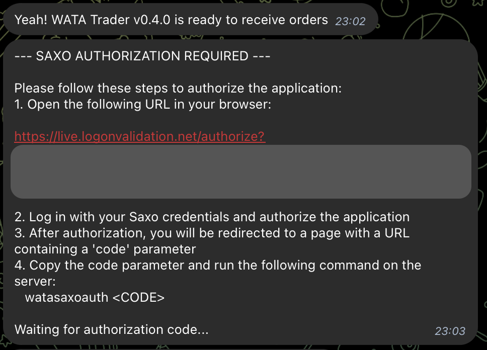

# 🔐  Saxo Bank Authentication

This document explains how to authenticate with Saxo Bank API for the WATA application.

## Authentication Process

1. When the application needs to authenticate with Saxo Bank, it will send you a URL via Telegram (or logs of container), that you need to open in your browser.



2. Open the provided URL in your web browser.

3. Log in with your Saxo Bank credentials and authorize the application.

4. After authorization, you'll be redirected to a page with a URL containing a `code` parameter. For example:
   ```
   http://localhost/callback?code=abc123def456ghi789&state=abcdef1234567890
   ```

5. Copy the value of the `code` parameter (in this example, `abc123def456ghi789`).

6. On the server where WATA is installed, run the following command:
   ```
   watasaxoauth <CODE>
   ```
   Replace `<CODE>` with the authorization code you copied.

7. The application will now continue with the authentication process using this code to obtain an access token.

```
2025-03-30 21:05:36,935 - saxo_auth_cli - INFO - Authorization code saved to /app/var/lib/saxo_auth/saxo_auth_code.txt
Authorization code saved successfully! The application will now continue with the authentication process.
```

## Troubleshooting

- If you receive an error about `Failed to obtain new tokens`, you provided an invalid or expired code. Repeat the process to get a fresh authorization code.
- The authorization code is valid only for a short time (typically a few minutes).
- If you see a "Timeout waiting for authorization code" error, it means the application waited for 5 minutes but didn't receive the authorization code.

## Command Reference

- `watasaxoauth <CODE>`: Submits the authorization code to the application
- `watastart`: Starts the application
- `watastop`: Stops the application
- `watalogs`: Shows application logs
- `watastatus`: Shows application status 