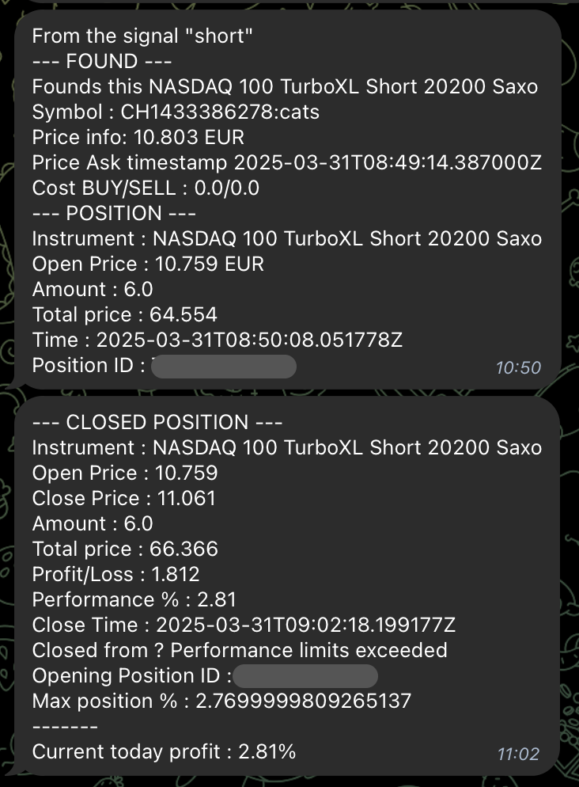

# 📊 Trading Workflow

WATA follows a systematic process to handle trading signals and execute trades. This workflow ensures reliability, consistency, and proper risk management.

## Signal to Execution Flow

1. **Signal Reception**
   - Validate incoming webhooks (authentication, token verification)
   - Parse action type (long, short, close)
   - Extract and validate required fields (indice, timestamps)

2. **Rule Validation**
   - Verify market hours (trading only during configured hours)
   - Check timestamp freshness (reject stale signals)
   - Validate allowed indices (only trade configured indices)
   - Apply daily profit limits (stop trading if daily goal reached)

3. **Trade Execution**
   - **For new positions**:
     - Search for optimal instrument based on configured parameters
     - Calculate order size based on account balance and risk settings
     - Place order and confirm position creation
   - **For closing positions**:
     - Retrieve current position details
     - Create closing order
     - Calculate and report performance metrics
   - **Position monitoring**:
     - Continuous position performance tracking
     - Automatic stop-loss/take-profit handling

4. **Performance Tracking**
   - Daily statistics generation
   - Performance metrics reporting
   - Database storage for analysis

## Example Notification Flow

WATA sends detailed notifications via Telegram at each step of the trading process:



## Webhook Configuration

To interact with WATA, send trading signals to:
```
POST /webhook?token=YOUR_SECRET_TOKEN
```

With a payload like:
```json
{
  "action": "long",
  "indice": "us100",
  "signal_timestamp": "2023-07-01T12:00:00Z",
  "alert_timestamp": "2023-07-01T12:00:01Z"
}
```

Available actions:
- `long`: Open a long position
- `short`: Open a short position
- `close-position`: Close the current position

The `indice` must match one of the allowed indices configured in your `config.json` file. 